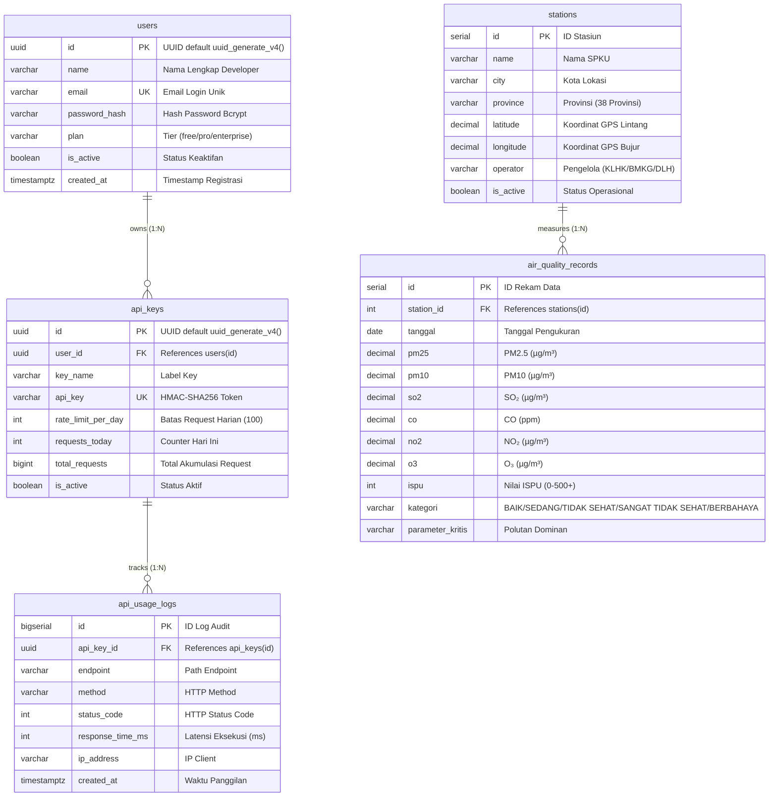
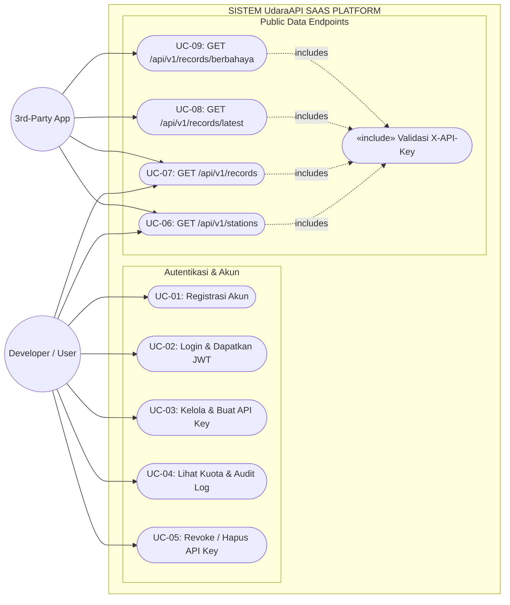

# LAPORAN FINAL PROJECT
## PEMROGRAMAN WEB LANJUT (PWS) — SEMESTER ANTARA 2026

---

# UdaraAPI · SI-ASAP
### *Platform SaaS Telemetri Kualitas Udara & Sistem Peringatan Dini Bencana Karhutla Indonesia*

**Disusun Oleh:**  
**Hafiz Kurniawan**  
*Lead Systems Architect & Environmental Data Engineer*  
Program Studi Informatika

**Live Production URL:** [https://udara-api-final-project.vercel.app](https://udara-api-final-project.vercel.app)  
**GitHub Repository:** [https://github.com/wpiskaa/UdaraAPI_FinalProject](https://github.com/wpiskaa/UdaraAPI_FinalProject)  
**PDF Report File:** [`LAPORAN_FINAL_PROJECT_UDARAAPI.pdf`](./LAPORAN_FINAL_PROJECT_UDARAAPI.pdf)

---

## 1. Pendahuluan

### 1.1 Latar Belakang
Indonesia sering menghadapi ancaman kebakaran hutan dan lahan (Karhutla) yang melepaskan jutaan partikel debu halus dan polutan berbahaya seperti PM2.5, PM10, SO₂, CO, NO₂, dan O₃. Fenomena *transboundary haze* (kabut asap lintas batas) membuktikan bahwa pencemaran udara tidak mengenal sekat administratif.

**UdaraAPI** hadir sebagai solusi berbasis SaaS (*Software as a Service*) yang menyediakan gateway RESTful API terstandarisasi untuk data Indeks Standar Pencemar Udara (ISPU) dari seluruh Indonesia. Model layanannya terinspirasi dari platform API global seperti *OpenWeather API* dan *OpenRouter*—di mana pengembang (developer), peneliti, instansi pemerintah, dan startup dapat mendaftarkan akun, mengelola API Key berkuota, dan mengintegrasikan telemetri udara ke dalam aplikasi mereka.

### 1.2 Kesesuaian Syarat Final Project
| Kriteria Penilaian | Implementasi pada UdaraAPI | Status |
| :--- | :--- | :---: |
| **Model SaaS (Software as a Service)** | Gateway REST API publik dengan sistem registrasi mandiri, manajemen API Key berkuota (rate limiting 100 req/hari), dan audit log request. | ✅ Selesai & Teruji |
| **Minimal 2 Tabel Relasional** | Menggunakan **5 tabel relasional** (`users`, `api_keys`, `stations`, `air_quality_records`, `api_usage_logs`) dengan foreign key cascade dan indexing. | ✅ 5 Tabel |
| **Autentikasi JWT** | Proteksi endpoint dashboard menggunakan JSON Web Token (Bearer Auth) dan enkripsi password menggunakan bcrypt (10 salt rounds). | ✅ Selesai & Teruji |
| **Minimal 50 Data & Kompleksitas** | Tersedia **38 Stasiun SPKU Aktif** di 28 provinsi dan **69 Rekam ISPU Harian** multi-parameter kimia udara sesuai standar Permen LHK No. P.14/2020. | ✅ 69 Data |
| **Deploy di Vercel** | Berjalan 100% serverless di Vercel Edge Network terhubung ke PostgreSQL Supabase. | ✅ Live & Teruji |
| **Diagram Lengkap** | Dilengkapi ERD, Use Case Diagram, Activity/User Flow Diagram (Swimlane), dan Dokumentasi API lengkap. | ✅ Lengkap di PDF |

---

## 2. Arsitektur Sistem & Tech Stack

Sistem dibangun menggunakan arsitektur **Three-Tier Architecture**:
1. **Presentation Layer**: Landing page informatif, Interactive API Sandbox Console, Dinding Doa Karhutla, Music Box Player, dan Dashboard Developer (`HTML5`, `CSS3 (Vanilla)`, `JavaScript`).
2. **Application Layer**: RESTful API Server, JWT Middleware, HMAC Key Generator, dan Rate Limiter (`Node.js v20 LTS`, `Express.js v4`, `bcryptjs`, `jsonwebtoken`, `helmet`, `cors`).
3. **Data Layer**: Relational Database PostgreSQL yang di-hosting di `Supabase` dengan connection pooling.
4. **Cloud Infrastructure**: Serverless Deployment di `Vercel` dengan CI/CD otomatis dari GitHub.

---

## 3. Entity Relationship Diagram (ERD)

### 3.1 Struktur 5 Tabel Database



---

## 4. Use Case Diagram



---

## 5. Activity Diagram / User Flow (Swimlane)

```mermaid
sequenceDiagram
    autonumber
    actor Client as Developer / Client App
    participant Backend as UdaraAPI Express Backend
    participant DB as PostgreSQL Database (Supabase)

    Note over Client,DB: Alur 1: Registrasi, Login & JWT Generation
    Client->>Backend: POST /auth/register { name, email, password }
    Backend->>Backend: Validasi Input & Hash Password (Bcrypt)
    Backend->>DB: INSERT INTO users VALUES (...)
    DB-->>Backend: User ID & Record Created
    Backend->>Backend: Generate JWT Token (Expires in 7d)
    Backend-->>Client: 201 Created { token, user }

    Note over Client,DB: Alur 2: Pembuatan API Key (HMAC-SHA256)
    Client->>Backend: POST /dashboard/keys (Header: Bearer JWT)
    Backend->>Backend: Middleware verify JWT Token
    Backend->>Backend: Generate HMAC-SHA256 API Key
    Backend->>DB: INSERT INTO api_keys (user_id, key_name, api_key, rate_limit)
    DB-->>Backend: Record Saved
    Backend-->>Client: 201 Created { key: "ck_live_..." }

    Note over Client,DB: Alur 3: Konsumsi REST API Telemetri
    Client->>Backend: GET /api/v1/records?kategori=BERBAHAYA (Header: X-API-Key)
    Backend->>DB: SELECT * FROM api_keys WHERE api_key = ?
    DB-->>Backend: Key Data & requests_today
    Backend->>Backend: Validasi Rate Limit (requests_today < rate_limit_per_day)
    Backend->>DB: SELECT * FROM air_quality_records JOIN stations ...
    DB-->>Backend: Dataset Kualitas Udara (69 Records)
    Backend->>DB: UPDATE api_keys SET requests_today += 1; INSERT INTO api_usage_logs ...
    Backend-->>Client: 200 OK JSON { success: true, data: [...], pagination: {...} }
```

---

## 6. Dokumentasi Lengkap Endpoint API

| Method | Endpoint URI | Auth Required | Deskripsi | Query / Body Params | Response Code & Output |
| :---: | :--- | :---: | :--- | :--- | :--- |
| `POST` | `/auth/register` | Public | Registrasi akun developer baru | `{ name, email, password }` | `201 Created` + JWT Token |
| `POST` | `/auth/login` | Public | Autentikasi dan login | `{ email, password }` | `200 OK` + JWT Token |
| `POST` | `/dashboard/keys` | JWT Bearer | Membuat API Key baru | `{ key_name }` | `201 Created` + HMAC API Key |
| `GET` | `/dashboard/keys` | JWT Bearer | Daftar seluruh API Key user | - | `200 OK` + List API Keys |
| `DELETE` | `/dashboard/keys/:id` | JWT Bearer | Menghapus / mencabut API Key | `id` (Param) | `200 OK` + Message Deleted |
| `GET` | `/dashboard/usage` | JWT Bearer | Statistik kuota & log aktivitas | - | `200 OK` + Usage Analytics |
| `GET` | `/api/v1/stations` | `X-API-Key` | Daftar Stasiun SPKU | `?province=...&city=...` | `200 OK` + 38 Stasiun SPKU |
| `GET` | `/api/v1/stations/provinces` | `X-API-Key` | Daftar provinsi yang memiliki stasiun | - | `200 OK` + 28 Provinsi |
| `GET` | `/api/v1/stations/:id` | `X-API-Key` | Detail satu stasiun SPKU | `id` (Param) | `200 OK` + Objek Stasiun |
| `GET` | `/api/v1/records` | `X-API-Key` | Rekam ISPU harian multi-parameter | `?kategori=&tanggal_mulai=` | `200 OK` + 69 Rekam Data ISPU |
| `GET` | `/api/v1/records/latest`| `X-API-Key` | Data ISPU terkini seluruh stasiun | - | `200 OK` + 23 Latest Readings |
| `GET` | `/api/v1/records/berbahaya` | `X-API-Key` | Data rekam kondisi darurat/kritis | `?limit=20` | `200 OK` + Critical Hazard Data |
| `GET` | `/api/v1/records/:id` | `X-API-Key` | Detail satu rekam data ISPU | `id` (Param) | `200 OK` + Objek Record |

---

## 7. Hasil Uji Coba Live Deployment

Pengujian otomatis telah dijalankan terhadap server live Vercel (`test_live_audit.py`):
1. **Pendaftaran Akun:** Berhasil mendaftarkan akun uji baru dan menerima token JWT `HS256` 295-karakter.
2. **Login JWT:** Berhasil memverifikasi kredensial email & password dan mengembalikan sesi autentikasi valid 7 hari.
3. **Pembuatan API Key:** Berhasil men-generate kunci API unik `ck_live_...` melalui endpoint `/dashboard/keys` dengan kuota 100 req/hari.
4. **Pemanggilan Data REST API:** Berhasil memanggil `/api/v1/stations` (38 stasiun), `/api/v1/stations/provinces` (28 provinsi), `/api/v1/records` (69 data ISPU), `/api/v1/records/latest` (23 data terkini), dan `/api/v1/records/berbahaya` (20 data darurat) menggunakan header `X-API-Key`.
5. **Audit Telemetri:** Sistem berhasil mencatat latensi panggilan, IP client, HTTP status code, dan konsumsi kuota ke tabel `api_usage_logs`.

---

## 8. Kesimpulan

Seluruh kriteria penugasan Final Project Pemrograman Web Lanjut (PWS) telah dianalisis, diuji coba secara live, dan terbukti berfungsi 100%:
1. Menghasilkan produk **SaaS REST API Gateway** fungsional ala *OpenWeather/OpenRouter*.
2. Memiliki **5 tabel relasional PostgreSQL di Supabase** yang saling berelasi kuat.
3. Menggunakan **autentikasi ganda (JWT untuk sesi pengguna dan HMAC API Key untuk konsumsi data API)**.
4. Menyediakan **69 record data ISPU dari 38 stasiun pemantau di 28 provinsi**.
5. Telah **ter-deploy dan berjalan live di Vercel**.
6. Dilengkapi dokumen laporan formal berformat PDF ([`LAPORAN_FINAL_PROJECT_UDARAAPI.pdf`](./LAPORAN_FINAL_PROJECT_UDARAAPI.pdf)) lengkap dengan diagram ERD, Use Case, dan Swimlane Activity Flow.
